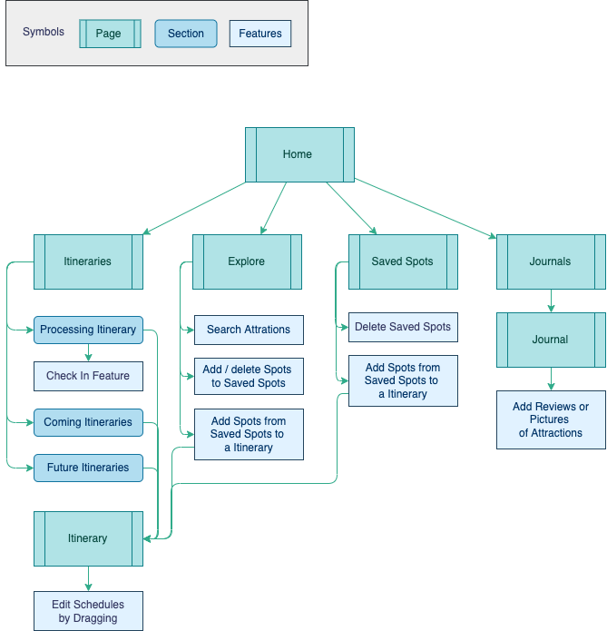
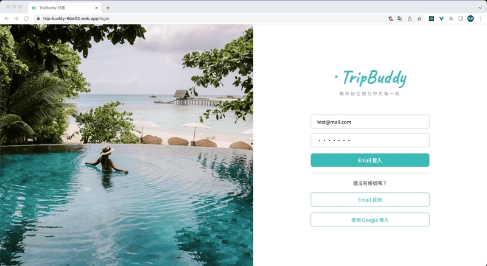

# TripBuddy 伴旅

> Recording your every momemts of travel

- A platform that able to create Itineraries and record your review after traval.
- Just simple dragging and your Itinerary schedule will be auto-generated.
- Writing Journal based on Itinerary your created before, no longer make it from zero.

## Link

- [https://trip-buddy-6be03.web.app](https://trip-buddy-6be03.web.app/)

## Flow Chart

## Technologies

### Libraries

- Web APIs
- React
  - useCotext, useReducer
- React Router
- React Beautiful Dnd
- React Transition Group
- React Toastify
- Emotion
- Material UI

### Cloud Services

- FireStore Database
- Firebase Storage
- Firebase Authentication
- Google Maps
- Google Maps Places API
- Google Maps Directions API

## Demo

### Login Page

- Provided native login & Google login

### Itineraries Page

- User's itineraries are sorted by time

#### Processing Itinerary

- List current shcedule and coming schedules today
- Abled to recored review tag or pictures you took to check in this spot

#### Coming Itineraries & Future Itineraries

- Itineraries will start in 7 days are sorted under coming Itineraries, and those are beyond 7 days will be sorted under Future Itineraries

### Explore

- Search Attractions and add to Saved Spots
- Manage Saved Spots list
- Add to or create a Itinerary with selected saved spots

### Saved Spots

- Able to manage saved sopts list, also can add selected spots to a new or exist Itinerary

### Itinerary

- Add Schedules by dragging spot card form waiting spots list
- Able to edit date, depart time, cover photo and other information of Itineraries

### Travel Journals

- Show all of Itineraries passed
- Able to see the check in record previosly, also can edit it here

### RWD

## Future Features

- Show routes on GoogleMaps in Journal page
- Show weather of each day of Journals
- Increase layout of picture to chose in Journals

## Contact

email: [page.acforshop@gmail.com](mailto:page.acforshop@gmail.com)
